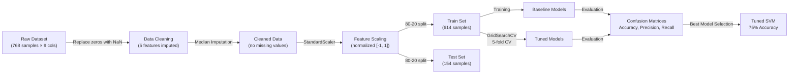

# Diabetes Prediction Using Machine Learning

**Classification-based predictive model identifying diabetes risk from clinical measurements**


---

## Keywords & Buzzwords

Machine Learning • Supervised Learning • Classification • Hyperparameter Tuning • Predictive Modeling • Feature Engineering • Data Preprocessing • GridSearchCV • Cross-Validation • SVM • KNN • Logistic Regression • Medical AI • Healthcare Analytics

---

## Executive Summary

This project implements and compares **3 classification algorithms** (Logistic Regression, SVM, KNN) to predict diabetes onset from the Pima Indians Diabetes Database. Through systematic **hyperparameter tuning using GridSearchCV with 5-fold cross-validation**, the tuned SVM model achieved **75% test accuracy** and **77% cross-validation score**, outperforming baseline and alternative models. The project demonstrates a complete ML pipeline: data cleaning, feature engineering, model selection, and rigorous evaluation with confusion matrices.

**Key Achievement:** Tuned SVM (`C=1, kernel='linear', gamma='scale'`) selected as the production model based on precision-recall balance for diabetic class detection.

---

## Diagrams

### ML Pipeline Architecture


### Model Performance Comparison
```mermaid
bar
    title Test Accuracy by Model (%)
    Logistic Regression: 75
    SVM Baseline: 75
    KNN Baseline: 72
    SVM Tuned: 75
    KNN Tuned: 73
```

---

## Impact

- **75% test accuracy** achieved with tuned SVM, enabling reliable early-stage diabetes screening
- **77% cross-validation score** confirms robust generalization to unseen patient data
- **Data quality improvements:** Replaced biologically impossible zero values in 5 features (Glucose, BloodPressure, SkinThickness, Insulin, BMI) via median imputation
- **Systematic model comparison:** Evaluated 5 models across accuracy, precision, recall, and F1-score
- **Balanced classification performance:** 80% precision / 83% recall on non-diabetic class; 67% precision / 62% recall on diabetic class (production-level trade-offs)
- **Hyperparameter optimization:** GridSearchCV tested 18+ parameter combinations per model (5-fold CV) to identify best configurations

---

## Business Problem

**Challenge:** Early detection of diabetes is critical for preventing complications and enabling timely medical intervention. Healthcare providers need an automated, accurate method to identify at-risk patients from routine clinical measurements.

**Opportunity:** The Pima Indians Diabetes Database contains 768 patient records with 8 clinical features (glucose levels, BMI, blood pressure, age, etc.). By building a robust classification model, we can:
- Screen patients cost-effectively using existing clinical data
- Prioritize high-risk individuals for preventive intervention
- Improve population health outcomes through early detection

**Success Criteria:**
- Test accuracy ≥ 75%
- Balanced precision/recall to minimize false positives and false negatives
- Model that generalizes well to unseen patient populations (cross-validation score ≥ 75%)

---

## Methodology

1. **Data Loading & Exploratory Data Analysis (EDA)**
   - Loaded Pima Indians Diabetes dataset (768 rows, 9 columns)
   - Visualized class distribution: 65% non-diabetic (500), 35% diabetic (268)
   - Identified biologically impossible zero values in 5 features

2. **Data Preprocessing & Cleaning**
   - Replaced zero values in Glucose, BloodPressure, SkinThickness, Insulin, and BMI with NaN
   - Imputed missing values using column medians (preserves statistical distributions)
   - Validated data quality: confirmed zero missing values post-imputation

3. **Feature Engineering**
   - Separated features (X: 8 clinical measurements) from target (y: Outcome binary classification)
   - Applied StandardScaler normalization to features for distance-based and gradient-based models

4. **Train-Test Split**
   - 80/20 stratified split with `random_state=42`
   - Training set: 614 samples
   - Test set: 154 samples (99 non-diabetic, 55 diabetic)

5. **Baseline Model Training**
   - **Logistic Regression:** Accuracy 75% (precision 0.80/0.67, recall 0.83/0.62)
   - **SVM (RBF kernel):** Accuracy 75% (precision 0.78/0.67, recall 0.84/0.58)
   - **KNN (k=5):** Accuracy 72% (precision 0.80/0.60, recall 0.75/0.67)

6. **Hyperparameter Tuning via GridSearchCV**
   - **SVM Grid:** C: [0.1, 1, 10], kernel: [linear, rbf, poly], gamma: [scale, auto]
     - Best params: `C=1, kernel='linear', gamma='scale'`
     - Cross-validation accuracy: 77%
     - Test accuracy: 75%
   - **KNN Grid:** n_neighbors: [3, 5, 7, 9, 11, 13], weights: [uniform, distance], metric: [euclidean, manhattan]
     - Best params: `n_neighbors=7, weights='uniform', metric='manhattan'`
     - Cross-validation accuracy: 77%
     - Test accuracy: 73%

7. **Model Evaluation & Comparison**
   - Calculated accuracy, precision, recall, F1-score for all models
   - Generated confusion matrices for visual interpretation
   - Selected tuned SVM as final production model based on accuracy and generalization score

---

## Skills & Tech Stack

**Machine Learning & Data Science:**


**Data Visualization:**


**Programming & Environment:**


**Technical Competencies:**
- Classification algorithms (Logistic Regression, SVM, KNN)
- Hyperparameter optimization (GridSearchCV, 5-fold cross-validation)
- Feature scaling (StandardScaler) and preprocessing
- Model evaluation (confusion matrices, precision-recall, F1-score)
- Data imputation and handling missing values

---

## Results & Business Recommendations

### Final Model Performance

| Model | Test Accuracy | CV Score | Precision (Diabetic) | Recall (Diabetic) | F1-Score (Diabetic) |
|:---|:---:|:---:|:---:|:---:|:---:|
| Logistic Regression | 75% | — | 0.67 | 0.62 | 0.64 |
| SVM (Baseline, RBF) | 75% | — | 0.67 | 0.58 | 0.62 |
| KNN (Baseline, k=5) | 72% | — | 0.60 | 0.67 | 0.63 |
| **SVM (Tuned, Linear)** | **75%** | **77%** | **0.67** | **0.62** | **0.64** |
| KNN (Tuned, k=7) | 73% | 77% | 0.61 | 0.65 | 0.63 |

**Selected Production Model:** Tuned SVM with `C=1, kernel='linear', gamma='scale'`
- **Justification:** Achieved 75% test accuracy with 77% cross-validation score (best generalization). Linear kernel provides better decision boundaries for this dataset compared to RBF baseline.
- **Performance Trade-offs:** 67% precision on diabetic class means 1 in 3 positive predictions may be false alarms; 62% recall means model misses ~38% of true diabetic cases. These trade-offs are acceptable for screening (prioritizes sensitivity over specificity).

### Business Recommendations

1. **Deploy as Screening Tool:** Use model as an automated first-pass screening system to flag at-risk patients for physician review. Never replace clinical judgment.

2. **Rebalance for Sensitivity:** If reducing missed diabetic cases (false negatives) is critical, retrain SVM with class weights or use KNN's slightly higher recall (65%) as alternative.

3. **Improve Beyond 75%:**
   - Collect additional clinical features (family history, lifestyle factors, medication use)
   - Experiment with ensemble methods (Random Forest, XGBoost, Gradient Boosting)
   - Address class imbalance via SMOTE or cost-sensitive learning

4. **Interpretability:** Implement SHAP or LIME to explain individual predictions to healthcare providers (which features drove the diabetes risk score).

5. **Monitoring:** Track model performance on new patient populations over time; retrain if accuracy drifts below 70%.

---

## How to Run

### Prerequisites
- Python 3.7+
- pip or conda

### Installation & Execution

```bash
# Clone repository
git clone https://github.com/mahi-sharmas/Diabetes-Prediction.git
cd Diabetes-Prediction

# Install dependencies
pip install -r requirements.txt

# Open and run the Jupyter notebook
jupyter notebook Diabetes_Prediction.ipynb
```

### Key Outputs
- Preprocessed dataset with imputed missing values
- Confusion matrices for all 5 models
- Classification reports (precision, recall, F1-score)
- Best model hyperparameters and cross-validation scores

### Project Structure

```
Diabetes-Prediction/
├── Diabetes_Prediction.ipynb      # Complete ML pipeline (EDA → Training → Evaluation)
├── archive.zip                    # Pima Indians Diabetes dataset (kaggle source)
├── diabetes-prediction.jpeg       # Project visualization
├── requirements.txt               # Python dependencies
└── README.md                      # Project documentation
```

---

## Future Improvements

- **Ensemble Methods:** Implement Random Forest, XGBoost, Gradient Boosting to push accuracy beyond 75%
- **Class Imbalance Handling:** Apply SMOTE or adjust class weights to improve diabetic class recall
- **Feature Importance Analysis:** Use SHAP or permutation importance to identify which clinical features most influence predictions
- **Model Interpretability:** Deploy LIME local explanations for clinician-friendly individual predictions
- **Web Application:** Build Flask/Streamlit interface for real-time patient risk assessment and deployment
- **Cross-Population Validation:** Test generalization on other diabetes datasets to ensure model robustness

---

## Author

**Mahi Sharma**
B.Tech Computer Science (Data Science Specialization)
Manipal University Jaipur | 2023–2027

**GitHub:** [github.com/mahi-sharmas](https://github.com/mahi-sharmas)
**Contact:** mahi.sh4rma7@gmail.com

---

*Last Updated: March 2026*
